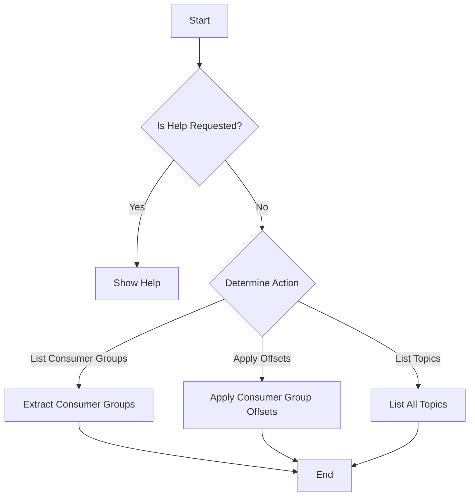
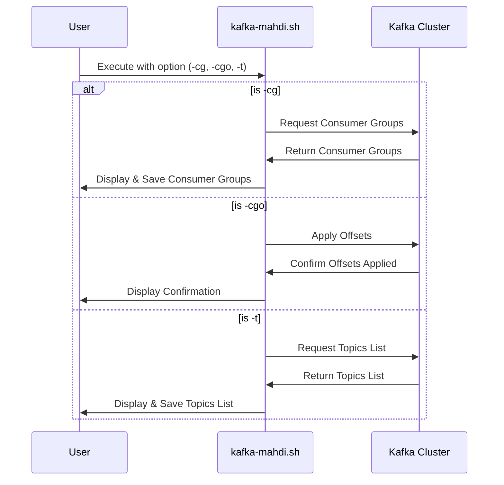

# kafka-mahdi


In the infinite streams of data, kafka-mahdi stands as the beacon for those who seek to maintain order and integrity within their Kafka clusters. May it serve you well, guiding your messages across the vastness of distributed systems.

## Overview
`kafka-mahdi` serves as a crucial tool in the ecosystem of Kafka, aimed at ensuring the synchronization of consumer group offsets across Kafka clusters. Drawing inspiration from the prophetic themes of *Dune*, this script acts as the Lisan al-Gaib, bridging the gaps between disparate data realms with precision and foresight.
## Features

### Script Functionalities
- **Consumer Group Extraction**: Identifies and lists all consumer groups from the source Kafka brokers.
- **Offset Application**: Adjusts consumer group offsets to ensure consistency across clusters.
- **Topic Listing**: Reveals all topics within a Kafka cluster, providing insights into the available data streams.

### Automated Update Checks
- The script checks for its latest version at startup and prompts for an update if a newer version is available.

## Prerequisites

To utilize `kafka-mahdi`, you must have:

- Docker installed and running on your machine.
- Access to Kafka clusters via specified brokers.
- Basic knowledge of Kafka administration and operations.

## Usage

1. **Clone the Repository:**
```
git clone https://github.com/PaulRoze/kafka-mahdi.git
```
2. **Add execution permissions:**
```
cd kafka-mahdi;
chmod +x kafka-mahdi.sh
```

3. **Execute the script with the following options to harness its capabilities:**

```bash
./kafka-mahdi.sh -h  # Display help and command options
./kafka-mahdi.sh -cg  # Extract consumer groups
./kafka-mahdi.sh -cgo  # Apply consumer group offsets
./kafka-mahdi.sh -t  # List all topics
```

## Script Help
To access the help menu for detailed usage instructions, run:
```
./kafka-mahdi.sh --help
```

## Logic Flow

## Sequence Diagram

## Issues and Support
For issues, feature requests, or assistance, please open an issue in the repository.
* Report by [opening a new issue](https://github.com/PaulRoze/kafka-mahdi/issues/new); it's that easy!

🧭 Crafting the Chronicle of Inquiry in kafka-mahdi:

1. **The Opening Scroll:** Initiate with a concise chronicle. Prepare the ground upon which your tale unfolds.

2. **The Path Through the Dunes:**

   - Chart the steps that led you into the maw of uncertainty or the bug’s embrace.
   - Scribe any incantations (code samples) you possess; they serve as guiding stars for those who follow.

3. **Visions Versus Reality:**

   - Your foresight of the events that were to transpire.
   - The reality that the sands of time have brought to bear.

4. **Whispers on the Wind:**

   - Share your insights, any ancient lore (theories), or attempted incantations (fixes) you've employed. Every piece of knowledge illuminates the path forward.

Let your reports be clear as the desert sky and detailed as the tapestries of Arrakis, aiding us in refining kafka-mahdi to better navigate the shifting sands of data streams.


## License
This project is released under the [MIT License](LICENSE).

## Acknowledgements

<!-- readme: collaborators,contributors -start -->
<table>
<tr>
    <td align="center">
        <a href="https://github.com/PaulRoze">
            
            <br />
            <sub><b>Pavel Rozentsvet</b></sub>
        </a>
    </td></tr>
</table>
<!-- readme: collaborators,contributors -end -->


